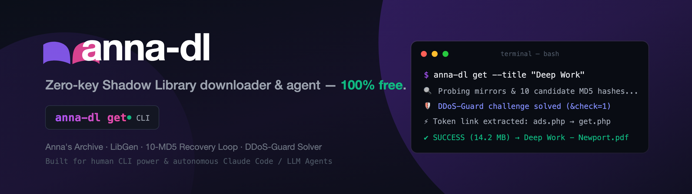
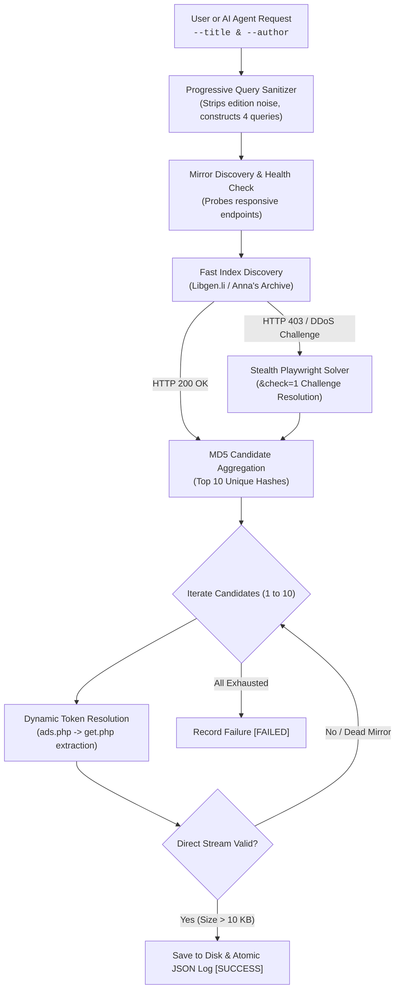

<p align="center">
  
</p>

<p align="center">
  <a href="https://pypi.org/project/anna-dl/"></a>
  <a href="https://www.python.org/downloads/"></a>
  <a href="LICENSE"></a>
  <a href="https://github.com/nsozturk/anna-dl/releases"></a>
  
  
  
</p>

<p align="center">
  <b>Resilient, Zero-Key Shadow Library Downloader CLI & AI Agent</b><br>
  Instant search, multi-mirror recovery, and high-speed streaming for Anna's Archive and Library Genesis (LibGen).
</p>

<p align="center">
  <code>annas-archive</code> • <code>libgen</code> • <code>shadow-library</code> • <code>book-downloader</code> • <code>ebook-downloader</code> • <code>python-cli</code> • <code>ai-agent</code> • <code>claude-code</code> • <code>open-access</code> • <code>research-automation</code>
</p>

---

## ⚡ Highlights & Why anna-dl?

* 🔓 **Zero Paid API Keys Required**: No donation keys or membership tokens needed. Operates freely over verified public mirror endpoints.
* 🚀 **Ultra Lightweight & Fast**: Pure Python core (`requests` + regex). Starts in milliseconds without heavy browser runtimes unless required.
* 🛡️ **DDoS-Guard & Cloudflare Bypass**: Automated fallback with stealth headless Chromium (`--disable-blink-features=AutomationControlled`, `delete navigator.webdriver`) to resolve JS challenges (`&check=1`) seamlessly when plain HTTP encounters `HTTP 403 Forbidden`.
* 🔄 **10-Candidate MD5 Recovery Loop**: Never stops at the first broken link. Extracts up to 10 unique MD5 candidates and sequentially probes working download mirrors.
* ⚡ **Direct Dynamic Token Extraction (`ads.php` → `get.php`)**: Extracts ephemeral download tokens on the fly for high-speed streaming.
* 🔍 **Smart Title Sanitizer**: Automatically cleans editions (`(2nd ed.)`), annotations, and subtitles, creating progressive 4-tier fallback queries.
* 🌐 **Built-in DNS Bypass**: Monkey-patches socket resolution directly to edge IP (`104.21.34.70`) to circumvent regional ISP blocks.
* 🤖 **First-Class AI Agent Interoperability**: Built from the ground up with explicit [AGENTS.md](AGENTS.md) contracts and exit codes for Claude Code, Gemini CLI, Cursor, Antigravity, OpenCode, and Codex.

---

## 🛠️ Retrieval Architecture



---

## 📦 Installation

```bash
# Clone the repository
git clone https://github.com/your-username/anna-dl.git
cd anna-dl

# Install dependencies
pip install -r requirements.txt

# Install CLI tool globally / in active environment
pip install -e .
```

*(Optional: For automatic DDoS-Guard JavaScript challenge resolution on direct Anna's Archive endpoints, install Playwright)*:
```bash
pip install playwright
playwright install chromium
```

---

## 🚀 CLI Usage Guide

### 1. Download a Single Book (`get`)

```bash
# Basic retrieval by title and author
anna-dl get --title "Atomic Habits" --author "James Clear"

# Custom search query override
anna-dl get --title "Thinking, Fast and Slow" --query "Kahneman Thinking Fast"

# Bypass regional or ISP DNS censorship
anna-dl get --title "Deep Work" --author "Cal Newport" --bypass-dns

# Custom destination folder
anna-dl get --title "Clean Code" --author "Robert Martin" --output-dir ./library
```

### 2. Batch Download & Recovery (`download` & `retry`)

```bash
# Download entire books_queue.json sequentially
anna-dl download

# High-throughput multi-threaded download (4 parallel workers)
anna-dl download --parallel --workers 4

# Filter batch by specific category prefixes
anna-dl download --categories 01,02,03

# Re-attempt failed or incomplete books
anna-dl retry --bypass-dns
```

### 3. Queue Extraction from Markdown Catalogs (`extract`)

Convert markdown tables (`| Title | Author | Year |`) into a clean `books_queue.json`:

```bash
anna-dl extract --docs-dir ./reading-lists/
```

### 4. Disk & Log Synchronization (`sync` & `status`)

```bash
# Verify downloaded files against log
anna-dl sync

# Display overall archive health & counts
anna-dl status
```

---

## 🤖 AI Agent Integration

`anna-dl` includes native root agent instructions ([AGENTS.md](AGENTS.md)) and an importable global rule snippet ([GLOBAL_AGENT_RULE.md](GLOBAL_AGENT_RULE.md)).

Copy `GLOBAL_AGENT_RULE.md` into your AI environment (`~/.claude/agents/anna-dl.md`, `~/.config/agent-rules/anna-dl.md`, or Cursor project rules) to give your LLM agent autonomous literature lookup capabilities.

---

## 🌐 2026 Mirror Network Status

> [!NOTE]
> `annas-archive.org` and `annas-archive.se` were seized in mid-2026. `anna-dl` automatically maintains the current roster of active, verified working mirrors:

* **Anna's Archive:** `https://annas-archive.gl` (Primary Default), `https://annas-archive.pk`, `https://annas-archive.gd`, `https://annas-archive.vg`
* **Library Genesis:** `libgen.la`, `libgen.gl`, `libgen.vg`, `libgen.is`, `libgen.rs`, `libgen.li`

---

## 🏷️ Release History

### **v1.0.0 (Initial Stable Release)**
- ✨ **Zero-Key Architecture:** Complete multi-mirror search without requiring paid API keys.
- 🛡️ **DDoS-Guard Evasion:** Stealth headless browser fallback resolving JS tests and `&check=1` redirects.
- 🔁 **10-Candidate Loop:** Resilient sequential fallback across top 10 MD5 hashes.
- ⚡ **Dynamic Token Extraction:** Real-time token acquisition via `ads.php` → `get.php`.
- 🔌 **Agent Contracts:** Full `AGENTS.md` and `GLOBAL_AGENT_RULE.md` specifications.

---

## ⚖️ Disclaimer

`anna-dl` is an educational open-source software project designed for researchers, educators, and archivists to discover and retrieve open-access and public domain scientific literature. The maintainers do not host or distribute copyright-infringing materials. Users are responsible for complying with the local laws of their respective jurisdictions.

---

## 📄 License

Distributed under the [MIT License](LICENSE).
